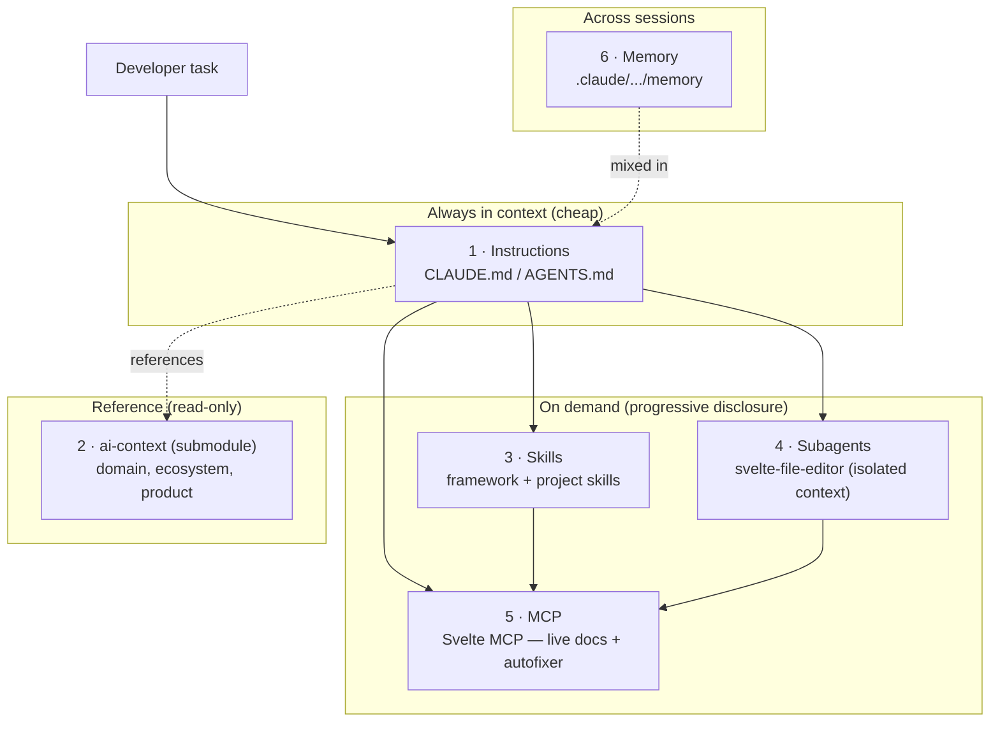

# Context + Prompt Engineering architecture

This document describes the **infrastructure and architecture** of AI-assisted
development in the Cadbos repository: how an AI agent (Claude Code and compatible
tools) gets the right context, and how we manage prompt quality. It is the "map" of
the foundation — an entry point for the team and for the agent itself.

> Related: brief team overview — [foundation-report.md](foundation-report.md);
> agent system instructions — [../../CLAUDE.md](../../CLAUDE.md) /
> [../../AGENTS.md](../../AGENTS.md).

---

## 1. Two dimensions

We separate two related but distinct aspects:

| Dimension | Question it answers | Provided by |
|---|---|---|
| **Context Engineering** | *What information* the agent sees, when, and from where | Instructions, knowledge base, skills, subagents, MCP, memory |
| **Prompt Engineering** | *How* a request/instruction is phrased for reliable output | CLAUDE.md workflow, `prompt-architect`, the `svelte-autofixer` loop |

The goal is **completeness**: for a typical development task the agent should have
all the context layers it needs and proven prompting techniques — without dragging
in noise (the least-context principle).

---

## 2. Context layers (Context Engineering)

Context is organized by **progressive disclosure** — from "always in context"
(cheap, small) to "on demand" (deep, expensive).



### Layer 1 — Instructions (always-on)
- **[AGENTS.md](../../AGENTS.md)** — the **single source of truth** for all agents:
  absolute rules, the Svelte MCP workflow, the context-architecture map, code style,
  and knowledge-base rules. Tool-agnostic (Cursor, Copilot, Goose, opencode, Gemini).
- **[CLAUDE.md](../../CLAUDE.md)** — a thin pointer that imports `AGENTS.md`
  (`@AGENTS.md`) so Claude Code gets the same content without drift.

### Layer 2 — Knowledge base (read-only reference)
- **[ai-context/](../../ai-context)** — git submodule `cadbos/ai-context`: domain
  (AEC / interior design), surveys of LLM chat interfaces, RAG, image generation,
  and the Nostr ecosystem. **Read-only**, reference not instructions (see CLAUDE.md).

### Layer 3 — Skills (progressive disclosure of knowledge)
Auto-loaded by task description. Installed in [.claude/skills/](../../.claude/skills):

- **Svelte 5 / SvelteKit (10):** `svelte-runes`, `svelte-components`,
  `svelte-styling`, `svelte-template-directives`, `sveltekit-data-flow`,
  `sveltekit-remote-functions`, `sveltekit-structure`, `svelte-deployment`,
  `svelte-layerchart`, `ecosystem-guide`.
- **Project (8):** `cadbos-conventions`, `cadbos-structure`, `cadbos-request-model`,
  `cadbos-integrations`, `cadbos-testing`, `cadbos-security`, `cadbos-commits`,
  `cadbos-self-review`.
- **Prompt Engineering (1):** `prompt-architect` — 27 frameworks (see §4).

### Layer 4 — Subagents (context isolation)
Isolated-context workers in [.claude/agents/](../../.claude/agents):
- **svelte-file-editor** — writes/edits/validates `.svelte` / `.svelte.ts`, always
  running code through `svelte-autofixer`.
- **test-runner** — runs and fixes Vitest + Playwright iteratively (noisy test
  output stays out of the main context).
- **code-reviewer** — read-only diff review against the `cadbos-*` rules; returns
  grouped findings.
- **a11y-validator** — accessibility/WCAG 2.1 AA audit of the UI.

### Layer 5 — MCP (live external context and tools)
- **Svelte MCP** (`https://mcp.svelte.dev/mcp`, configured in
  [.mcp.json](../../.mcp.json)) — `list-sections`, `get-documentation` (current
  official docs), `svelte-autofixer` (static analysis + autofix), `playground-link`.
  The source of truth for Svelte 5 syntax.

### Layer 6 — Memory (across sessions)
- The agent's file-based memory under `~/.claude/projects/.../memory` — durable
  facts about the user, project, and decisions; mixed into context at session start.

---

## 3. Flow of a typical task

1. **Instructions (L1)** set role and workflow.
2. The agent consults **domain context (L2)** when relevant.
3. Relevant **skills (L3)** load by topic — including the `cadbos-*` project skills.
4. For writing/editing `.svelte`, delegate to the **subagent (L4)**.
5. Any Svelte code goes through the **MCP loop (L5)**: `list-sections` →
   `get-documentation` → code → `svelte-autofixer` (repeat to zero issues).
6. Significant decisions are saved to **memory (L6)**.

---

## 4. Prompt Engineering

- **CLAUDE.md workflow** — a deterministic procedure (docs → code → autofixer →
  result → playground on request). A "prompt contract" for every Svelte task.
- **`prompt-architect`** — a library of 27 proven frameworks across 7 intents
  (create / transform / reason / critique / recover / clarify / agentic): RACE,
  CO-STAR, RISEN, Chain-of-Thought, Tree-of-Thought, Self-Refine, etc. Applied when
  designing or improving a prompt.
- **The `svelte-autofixer` loop** — automated quality control for generated code
  (effectively a "prompt eval" for Svelte): code is done only at zero findings.

---

## 5. Mapping to the official Svelte model

The Svelte team describes four complementary tools — this foundation implements all
four:

| Official Svelte tool | Implementation here |
|---|---|
| Instructions (AGENTS.md/CLAUDE.md) | [CLAUDE.md](../../CLAUDE.md) + [AGENTS.md](../../AGENTS.md) ✅ |
| MCP Server | Svelte MCP in [.mcp.json](../../.mcp.json) ✅ |
| Skills | 10 Svelte + 8 project skills in [.claude/skills](../../.claude/skills) ✅ |
| Subagents | svelte-file-editor, test-runner, code-reviewer, a11y-validator ✅ |

---

## 6. File map

```
CLAUDE.md                      # L1 — Claude-specific instructions
AGENTS.md                      # L1 — portable instructions (other tools)
.mcp.json                      # L5 — remote Svelte MCP
.gitignore                     # excludes personal settings.local.json
.claude/
  agents/                      # L4 — subagents: svelte-file-editor, test-runner,
                               #      code-reviewer, a11y-validator
  settings.json                # hooks (svelte-legacy-guard)
  hooks/svelte-legacy-guard.py # Svelte 4 syntax guard
  skills/                      # L3 — 10 Svelte + 8 cadbos-* + prompt-architect
ai-context/                    # L2 — submodule, domain/ecosystem (read-only)
docs/ai-development/
  architecture.md              # this file
  foundation-report.md         # brief team report
  ecosystem-survey.md          # audit of ai-context project repos
  skill-authoring.md           # how to write skills (200-line rule)
```

---

## 7. Gaps and directions

> A prioritized backlog derived from the `ai-context` ecosystem audit is in
> [ecosystem-survey.md](ecosystem-survey.md) (§4). Summary below.

- A domain MCP and reusable Svelte/Nostr SDKs — only if the product moves toward
  Nostr.
- A skills-per-module router — once the app is split into modules.
- Vetting third-party skills — `prompt-architect` ships unreviewed Python scripts;
  read them before relying on them.
