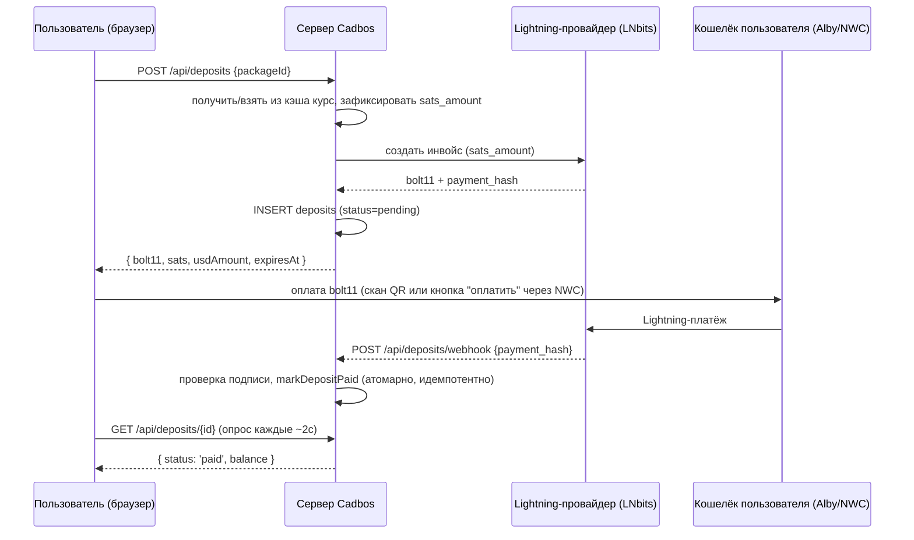

# Оплата в sats через Lightning — проектный документ

## 1. Цель

Дать пользователю купить пакет генераций номиналом **$1 / $3 / $5**, оплатить его
в **sats через Lightning** и видеть баланс Cadbos в **долларах**. Без карточного
процессинга, без KYC-шлюза — только Bitcoin/Lightning, что естественно ложится на
уже существующую Nostr-идентичность (Модуль 2: аккаунт и так _есть_ pubkey).

### Не входит в объём (v1)

- **Полноценные социальные zap'ы NIP-57** (события kind `9734`/`9735`,
  публикуемые в релеи, видимые в профиле/посте) — реальная сложность (публикация
  в релеи, верификация receipt), которая ничего не даёт для приватного пополнения
  баланса. В v1 принимается обычный Lightning-платёж по инвойсу конкретной покупки;
  что добавит наслоение настоящих zap'ов позже — см. [§8](#8-фаза-2-настоящие-zap-ы-nip-57-опционально).
- **Fiat/карточный ончейн внутри Cadbos** — вне объёма; пользователи приносят свои
  sats сами (из существующего кошелька или купленные через внешний он-рамп, см.
  [§9](#9-получение-тестовых-sats-через-getalby)).
- **Возвраты/чарджбэки** — Lightning-платежи безвозвратны; в v1 нет флоу отмены.
- **Свой Lightning-узел** — v1 использует хостингового провайдера (§3), а не
  `lnd`/`cln`, управляемый нами.

## 2. Как это расширяет существующую модель

В Модуле 6 (`src/lib/server/billing.ts`, `src/lib/server/generations.ts`) уже есть
всё, что находится _после_ факта "у аккаунта есть баланс":

- Таблица `credits`: `user_id`, `balance`, `updated_at`, `enabled`
  ([migrations/0004_credits.sql](../migrations/0004_credits.sql),
  [migrations/0005_generation_access.sql](../migrations/0005_generation_access.sql)).
- `recordGeneration()` ([src/lib/server/generations.ts:91](../src/lib/server/generations.ts))
  атомарно списывает с `credits.balance` и пишет запись в журнал `generations`.
- `getUserIdByPubkey()` ([src/lib/server/billing.ts:29](../src/lib/server/billing.ts))
  превращает Nostr pubkey из сессии во внутренний `user_id`.
- В `UserUsageRecord` ([src/lib/api/contract.ts:90](../src/lib/api/contract.ts)) уже
  есть поля `totalDeposit` / `lastDepositAt` — сейчас захардкожены в `0`/`null` в
  [src/lib/server/generations.ts:184](../src/lib/server/generations.ts). Они
  созданы именно под эту фичу — это единственная заготовка, которая уже есть.

Не хватает всего, что находится _до_ этого: собственно превращения sats в
пополнение `credits.balance`. Документ добавляет только это — то, как баланс
тратится, не меняется.

## 3. Выбор Lightning-провайдера

Cadbos работает на Cloudflare Workers (`wrangler.jsonc`) — нет постоянного
процесса, нет прямого TCP/gRPC-сокета к своему `lnd`. Провайдер обязан отдавать
**обычный HTTPS REST API + webhook**, что исключает прямое общение с узлом.

| Вариант                                                                                   | Насколько подходит                                                                                                                                                                                                                                                                              | Компромисс                                                                                                                                                                                                                                                        |
| ----------------------------------------------------------------------------------------- | ----------------------------------------------------------------------------------------------------------------------------------------------------------------------------------------------------------------------------------------------------------------------------------------------- | ----------------------------------------------------------------------------------------------------------------------------------------------------------------------------------------------------------------------------------------------------------------- |
| **LNbits** (хостинговый инстанс или self-hosted на небольшой VM)                          | REST API + поле `webhook` на каждый инвойс; расширение `lnurlp` может выдать настоящий Lightning Address/LNURL-pay для аккаунта — естественный мост к настоящим zap'ам NIP-57 в будущем. По умолчанию кастодиальный (LNbits держит средства в своём узле/аккаунте), но инстансом управляете вы. | Придётся эксплуатировать (или доверять) ещё один сервис; хостинговый LNbits (например, `legend.lnbits.com`) кастодиален для третьей стороны.                                                                                                                      |
| **Кастодиальный wallet-as-a-service** (OpenNode, Speed, Strike)                           | Может выставлять **инвойсы напрямую в USD** — конвертацию sats↔USD делает провайдер, что полностью снимает с нас риск курса. Зрелые webhook + REST API.                                                                                                                                         | Обычно требует бизнес-аккаунт с KYC; менее "Nostr-нативно", больше похоже на обычный платёжный процессор.                                                                                                                                                         |
| **NWC (Nostr Wallet Connect) к кошельку, который держим мы** (например, инстанс Alby Hub) | Максимально Nostr-идиоматично — сервер хранит одну строку подключения `nostr+walletconnect://` и вызывает `make_invoice`/`lookup_invoice` через релей. Отдельный REST-аккаунт провайдера не нужен.                                                                                              | Запрос/ответ идёт через Nostr-релей (WebSocket), а не обычный REST — на Workers это реализуемо (исходящий WebSocket поддерживается), но больше движущихся частей и зависимость от релея прямо в платёжном пути; на этом этапе менее обкатано, чем REST-провайдер. |

**Рекомендация**: начать с **LNbits** (хостинговый инстанс — самый быстрый способ
попробовать; переход на self-hosted — когда потребуется полное доверие для
продакшена). Это REST-first решение (вписывается в Workers без доп. инфраструктуры),
с полноценной поддержкой webhook на каждый инвойс, а его расширение `lnurlp` —
тот же строительный блок, что понадобится для настоящего приёма zap'ов — то есть
этот выбор не закрывает путь к §8 позже. Пересмотреть решение стоит, если учётка,
которую вы поделитесь (см. [§9](#9-получение-тестовых-sats-через-getalby)),
указывает на конкретного провайдера, к которому лучше привязаться.

Это решение можете финализировать только вы (комплаенс-позиция, кто держит
средства между оплатой и выплатой) — отмечено ещё раз в [§10](#10-открытые-вопросы).

## 4. Курс обмена

- **Источник**: публичный API курса (например, CoinGecko
  `/simple/price?ids=bitcoin&vs_currencies=usd` или тикер Kraken/Coinbase). Любой
  единственный источник — это единая точка отказа для ценообразования; для v1 с
  небольшими фиксированными пакетами это приемлемо.
- **Кэш**: добавить Workers KV-биндинг (например, `RATES_KV`) и кэшировать курс
  sats-за-доллар с коротким `expirationTtl` (60–120 с). Это избавляет от лишних
  запросов к API курса при каждом создании инвойса и ограничивает "устаревание"
  курса.
- **Фиксация курса, а не просто отображение**: курс должен фиксироваться **один
  раз, в момент создания инвойса**, и сохраняться в строке `deposits`
  (`sats_amount` фиксируется в этот же момент). Webhook курс заново не запрашивает
  — он только подтверждает, что _sats_-инвойс на уже зафиксированную сумму _sats_
  оплачен. Это исключает классический баг, когда движение цены между "показали QR"
  и "пользователь оплатил" меняет сумму к оплате.
- Пакеты определены как **фиксированный номинал в USD** ($1/$3/$5 → фиксированный
  `credits_awarded`); "плавает" вместе с курсом только сумма инвойса в sats.

## 5. Модель данных — миграция `0007_deposits.sql`

Только аддитивно; без изменений в `credits`/`generations`.

```sql
-- Пополнения через Lightning-платежи (пост-MVP эпик — см.
-- docs/payments-lightning-sats.md). Строка `packages` — статичные данные
-- каталога (заполняются один раз, редактируются админом); строка `deposits` —
-- одна попытка покупки, от создания инвойса до подтверждения оплаты (или
-- истечения срока). credits.balance трогается только когда deposit
-- переходит в 'paid' — тем же атомарным batch'ем, что уже использует
-- recordGeneration() для списаний (generations.ts).

CREATE TABLE packages (
	id TEXT PRIMARY KEY,
	usd_amount REAL NOT NULL,
	credits_awarded REAL NOT NULL,
	enabled INTEGER NOT NULL DEFAULT 1,
	created_at INTEGER NOT NULL
);

CREATE TABLE deposits (
	id TEXT PRIMARY KEY,
	user_id TEXT NOT NULL REFERENCES users (id),
	package_id TEXT NOT NULL REFERENCES packages (id),
	provider TEXT NOT NULL,
	provider_invoice_id TEXT NOT NULL,
	payment_hash TEXT NOT NULL,
	sats_amount INTEGER NOT NULL,
	usd_amount REAL NOT NULL,
	sats_per_usd_rate REAL NOT NULL,
	credits_awarded REAL NOT NULL,
	status TEXT NOT NULL DEFAULT 'pending' CHECK (status IN ('pending', 'paid', 'expired', 'failed')),
	created_at INTEGER NOT NULL,
	expires_at INTEGER NOT NULL,
	paid_at INTEGER
);

CREATE UNIQUE INDEX deposits_payment_hash ON deposits (payment_hash);
CREATE INDEX deposits_user_created_at ON deposits (user_id, created_at DESC);
CREATE INDEX deposits_status ON deposits (status) WHERE status = 'pending';
```

`UNIQUE` на `deposits_payment_hash` — это защита от повторной обработки:
повторный webhook от провайдера (или replay атакующим, каким-то образом узнавшим
hash) может пометить одну и ту же строку оплаченной только один раз — второй
`UPDATE ... WHERE status = 'pending'` затронет ноль строк.

## 6. Серверный модуль — `src/lib/server/payments.ts`

Повторяет форму `billing.ts`/`generations.ts`, а не вводит новый паттерн:

```ts
export async function listPackages(db: D1Database): Promise<Package[]>;

export async function createDeposit(
	db: D1Database,
	userId: string,
	packageId: string,
	rate: ExchangeRate // { satsPerUsd, fetchedAt }
): Promise<Deposit>; // status: 'pending'; также вызывает LN-провайдера для создания инвойса

export async function markDepositPaid(db: D1Database, paymentHash: string): Promise<Balance | null>;
// Атомарный D1 batch (та же форма, что и recordGeneration):
//   UPDATE deposits SET status='paid', paid_at=? WHERE payment_hash=? AND status='pending'
//   UPDATE credits SET balance = balance + (SELECT credits_awarded FROM deposits WHERE payment_hash=?), updated_at=? WHERE user_id=?
// Если у покупателя ещё не было строки в credits.balance — upsert (ON CONFLICT),
// как это уже делает recordBalance().

export async function getDeposit(
	db: D1Database,
	id: string,
	userId: string
): Promise<Deposit | null>;

export async function expireStaleDeposits(db: D1Database, now: number): Promise<number>;
// UPDATE deposits SET status='expired' WHERE status='pending' AND expires_at < ?
```

`src/lib/server/lightning.ts` изолирует специфичные для провайдера HTTP-вызовы
(`createInvoice`, `verifyWebhookSignature`) за небольшим интерфейсом, чтобы замена
LNbits на другого провайдера позже (§3) не затрагивала `payments.ts` и роуты.

## 7. API и флоу

| Роут                    | Метод | Назначение                                                                                                                                                        |
| ----------------------- | ----- | ----------------------------------------------------------------------------------------------------------------------------------------------------------------- |
| `/api/packages`         | GET   | Список из 3 пакетов (id, usd_amount, credits_awarded). Условно публичный, но всё равно за сессией, как и весь остальной app.                                      |
| `/api/deposits`         | POST  | Тело `{ packageId }`. Создаёт строку `deposits` + Lightning-инвойс, возвращает `{ depositId, bolt11, sats, usdAmount, expiresAt }`.                               |
| `/api/deposits/[id]`    | GET   | Опрос статуса: `{ status, balance? }`. Используется клиентом пока ждём оплату.                                                                                    |
| `/api/deposits/webhook` | POST  | Коллбэк провайдера. Проверяет подпись, находит `payment_hash`, вызывает `markDepositPaid`. Не защищён сессией (вызывает провайдер), но защищён проверкой подписи. |



Та же схема защиты, что и у `/api/render` (`src/routes/api/render/+server.ts:36`):
требуется сессия, `getUserIdByPubkey` разрешает аккаунт, и любая запись идёт по
уже разрешённому `userId`, никогда — по значению, присланному клиентом.

## 8. Фаза 2: настоящие zap'ы NIP-57 (опционально)

Если позже станет важно, чтобы пополнение выглядело как настоящий публичный zap
(например, видимый в Nostr-профиле пользователя, социальное доказательство,
совместимость с другими Nostr-клиентами), это можно наслоить, не трогая модель
credits/generations:

1. Выдать через-аккаунтный (или один общий) **Lightning Address** через
   расширение `lnurlp` в LNbits, с поддержкой query-параметра `nostr`, которого
   требует NIP-57.
2. В LNURL-pay callback принимать параметр `nostr` с подписанным событием
   kind `9734` (zap request); после оплаты публиковать receipt kind `9735` в
   релеи, перечисленные в запросе (переиспользуя уже имеющийся в репозитории
   инстанс NDK для авторизации Модуля 2 — `@nostr-dev-kit/ndk`).
3. `payment_hash` по-прежнему остаётся ключом связи со строкой `deposits` —
   обработчик webhook из §7 не меняется, учёт zap request/receipt добавляется
   только на этапе _создания_ инвойса.

Не требуется для "принять sats, зачислить доллары" — нужно только для того,
чтобы платёж стал видимым Nostr-событием.

## 9. Получение тестовых sats через getAlby

Для ручного тестирования, когда реальная оплата заработает, самый быстрый способ
получить sats в кошелёк, готовый к трате, — это **встроенная функция покупки в
кастодиальном кошельке**, а не разворачивание Alby Hub с ончейн-каналом:

- **Alby Account** или **Wallet of Satoshi**: встроенная кнопка "Buy Bitcoin" →
  оплата картой/Apple Pay через партнёрский он-рамп (например, Mt Pelerin) → sats
  сразу попадают в Lightning-баланс → отправка в один клик на наш инвойс/Lightning
  Address.
- Не стоит: открывать **Alby Hub** с ончейн-каналом только ради теста — это путь
  self-custodial/роутинг-узла, избыточная сложность ради отправки нескольких тысяч
  sats для проверки webhook.

Nostr-учётка, которую вы поделитесь, уже содержит sats, так что этот раздел
пригодится в основном для повторяемого тестирования уже после этого разового
случая.

## 10. Открытые вопросы

Здесь нужно решение от вас, а не инженерное значение по умолчанию:

1. **Провайдер**: LNbits (хостинговый vs self-hosted) vs кастодиальный процессор
   с KYC (OpenNode/Speed) vs NWC к своему Alby Hub — меняет, кто держит средства,
   комплаенс-периметр и кто видит метаданные транзакций.
2. **Точное значение `credits_awarded` на пакет** — $1 → 1 единица уже абстрактного
   "баланса" Модуля 6, или нужна явная таблица конвертации sats/генерация ↔ USD?
3. **Срок действия депозита** — сколько неоплаченный инвойс остаётся валидным до
   того, как `expireStaleDeposits` пометит его `expired` (влияет на UX при
   медленной/неудавшейся оплате)?
4. **Входит ли Фаза 2 (настоящие zap'ы, §8) в объём вообще**, или "принять sats,
   зачислить приватный баланс в USD" — это вся фича?

## 11. Оценка по срокам

| Шаг                                                                                                                                  | Зависит от                    | Трудозатраты |
| ------------------------------------------------------------------------------------------------------------------------------------ | ----------------------------- | ------------ |
| Миграция `0007_deposits.sql` + `payments.ts` + `lightning.ts` (клиент провайдера)                                                    | Решение по провайдеру (§10.1) | 2–3 дня      |
| Роуты `/api/packages`, `/api/deposits`, `/api/deposits/webhook` + rate-limiting (переиспользовать `rate-limit.ts`)                   | Выше                          | 2 дня        |
| Запрос курса + кэш в KV                                                                                                              | —                             | 0.5 дня      |
| Клиент: карточки пакетов, отображение инвойса/QR, опрос до оплаты, обновление баланса                                                | Роуты выше                    | 2–3 дня      |
| Подключить `UserUsageRecord.totalDeposit`/`lastDepositAt` к реальным данным `deposits` в `listUserUsage`                             | Миграция выше                 | 0.5 дня      |
| Vitest (идемпотентность webhook, фиксация курса, валидация пакетов) + Playwright (полный флоу покупки против замоканного провайдера) | Всё выше                      | 2 дня        |

**Итого: ~1.5–2 недели** для одного исполнителя, что совпадает с более ранней
оценкой — этот документ просто делает каждый шаг достаточно конкретным, чтобы
начать работу сразу после ответа на §10.
