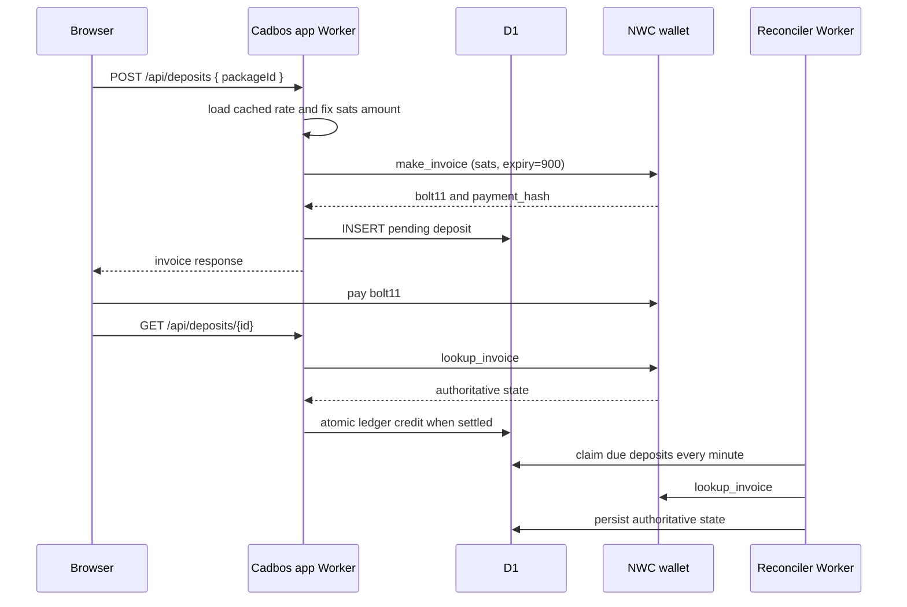

# Оплата в sats через Lightning — текущее устройство

## 1. Назначение и границы v1

Пользователь Cadbos покупает один из фиксированных USD-пакетов, оплачивает
Lightning invoice в sats и получает внутренний баланс для генераций. Аккаунт
определяется существующей Nostr-сессией; платёж не является публичным zap-событием.

В v1 не входят карточные платежи, возвраты, NIP-57 zap request/receipt и собственный
Lightning-узел Cadbos.

## 2. Принятое решение

Cadbos подключается по Nostr Wallet Connect (NIP-47) к единственному кошельку,
который держит компания. `src/lib/server/lightning.ts` разбирает
`nostr+walletconnect://` URI и выполняет `make_invoice` и `lookup_invoice` через
указанные в нём Nostr-релеи.

Строка подключения хранится только в Cloudflare secret
`NWC_CONNECTION_STRING`. Она содержит клиентский Nostr private key, поэтому не
попадает в git, client bundle, HTTP-ответы и логи. Secret устанавливается отдельно
для двух Workers:

- основного SvelteKit Worker, который создаёт invoice и проверяет его при клиентском
  polling;
- `cadbos-deposit-reconciler`, который продолжает проверку без открытого браузера.

Оба Worker используют одну D1 database и одно значение NWC connection string.

## 3. Production-пакеты и курс

Миграция `migrations/0010_payment_packages.sql` создаёт рабочий каталог:

| ID      | Цена | App credits | archAI tokens |
| ------- | ---: | ----------: | ------------: |
| `pkg-1` |   $1 |           3 |             3 |
| `pkg-3` |   $3 |           9 |             9 |
| `pkg-5` |   $5 |          15 |            15 |

`archai_tokens_awarded` — внутреннее обеспечение общего ledger и не возвращается
клиенту через `/api/packages`. Отключённые строки остаются в истории, но не
показываются и не принимаются для новых покупок.

При создании депозита сервер получает BTC/USD rate и вычисляет сумму как
`ceil(usd_amount * sats_per_usd)`. Production provider по умолчанию — Kraken;
CoinGecko и Coinbase доступны как альтернативные реализации. Результат каждого
provider кэшируется в D1 на 90 секунд. Зафиксированные `sats_amount` и
`sats_per_usd_rate` записываются в депозит и больше не пересчитываются.

## 4. Данные и ledger

`migrations/0007_ledgers.sql` создаёт основные сущности оплаты:

- `packages` — каталог доступных номиналов;
- `deposits` — snapshot выбранного пакета и invoice;
- `ledger_accounts`, `ledger_transactions`, `ledger_entries` — неизменяемый журнал
  начислений и списаний;
- `generation_access` — разрешение аккаунту пользоваться генерацией.

Депозит хранит владельца, пакет, BOLT11 invoice, payment hash, USD/sats/rate,
начисляемые credits/tokens, статус, время создания и истечения, результаты проверки
provider и связанную ledger transaction. Snapshot защищает начисление от будущего
изменения каталога.

После авторитетного `settled` функция `markDepositPaid()` одним D1 batch:

1. создаёт пользователю `app_credit` account, если это первая покупка;
2. включает `generation_access`;
3. начисляет package credits пользователю и package tokens глобальному
   `archai_token` account;
4. финализирует ledger transaction и переводит депозит в `paid`.

Повторная обработка того же payment hash идемпотентна. Оплаченные депозиты и
финализированные ledger-записи защищены SQL triggers от изменения и удаления.
Ledger хранит денежные значения в целочисленных сотых долях; API продолжает
работать с обычными decimal numbers.

## 5. Срок invoice и reconciliation

Каждый invoice создаётся со сроком **15 минут (900 секунд)**. Локальный
`expires_at` равен времени создания депозита плюс 900 секунд и используется UI как
граница текущей попытки оплаты.

Локальное время не является доказательством окончательного статуса. Ответ кошелька
через `lookup_invoice` авторитетен:

- `settled` начисляет пакет даже после локального `expires_at`;
- `pending` и `accepted` оставляют депозит ожидающим следующей проверки;
- `expired` и `failed` становятся финальными только после ответа кошелька;
- старый локально завершённый депозит может быть восстановлен в `paid`, если
  кошелёк сообщает фактическое settlement.

Новый депозит впервые ставится на проверку через минуту. Cron Worker запускается
каждую минуту, арендует до 20 due-записей на 120 секунд и проверяет их с
concurrency 5. Успешно ожидающие invoice снова планируются через минуту; ошибка
отдельного lookup учитывается и не останавливает остальной batch.

## 6. API и пользовательский поток

| Интерфейс                   | Назначение                                                                                                                              |
| --------------------------- | --------------------------------------------------------------------------------------------------------------------------------------- |
| `GET /api/packages`         | Возвращает включённые пакеты как `{ id, usdAmount, creditsAwarded }`, отсортированные по цене.                                          |
| `POST /api/deposits`        | Принимает `{ packageId }`, фиксирует rate, создаёт invoice и возвращает `{ id, status, bolt11, satsAmount, usdAmount, expiresAt }`.     |
| `GET /api/deposits/[id]`    | Проверяет принадлежащий пользователю депозит; при необходимости делает `lookup_invoice`, а для `paid` возвращает обновлённый `balance`. |
| `cadbos-deposit-reconciler` | Scheduled Worker, который подтверждает платежи независимо от браузера.                                                                  |

```mermaid
sequenceDiagram
    participant U as Browser
    participant A as Cadbos app Worker
    participant D as D1
    participant N as NWC wallet
    participant C as Reconciler Worker

    U->>A: POST /api/deposits { packageId }
    A->>A: load cached rate and fix sats amount
    A->>N: make_invoice (sats, expiry=900)
    N-->>A: bolt11 and payment_hash
    A->>D: INSERT pending deposit
    A-->>U: invoice response
    U->>N: pay bolt11
    U->>A: GET /api/deposits/{id}
    A->>N: lookup_invoice
    N-->>A: authoritative state
    A->>D: atomic ledger credit when settled
    C->>D: claim due deposits every minute
    C->>N: lookup_invoice
    C->>D: persist authoritative state
```

## 7. Безопасность и эксплуатация

- Оба API route требуют аутентифицированную Nostr-сессию; запрос статуса дополнительно
  ограничен владельцем депозита.
- Создание invoice ограничено пятью запросами в минуту на аккаунт, status polling —
  десятью запросами за десять секунд.
- Dev demo account не может обращаться к реальному кошельку.
- Ошибки NWC логируются без connection string, invoice, payment hash и пользовательских
  данных.
- Отсутствующий secret закрывает создание покупок и возвращает retryable ошибку при
  проверке статуса; reconciler завершает запуск ошибкой вместо пропуска платежей.

Production-порядок описан в `README.md`: применить remote D1 migrations, установить
`NWC_CONNECTION_STRING` отдельно для каждого Worker, затем развернуть приложение и
reconciler. Значение вводится интерактивно через `wrangler secret put`.

## 8. Проверка

Автоматические тесты покрывают каталог миграции, фиксацию rate и срока invoice,
валидацию package ID, идемпотентное начисление двух ledger assets, восстановление
позднего settlement, leasing очереди, cron batch и полный UI-поток покупки с
замоканным provider boundary. Реальные внешние Lightning-платежи выполняются только
при ручной проверке настроенного production/test wallet.

## 9. Возможное продолжение

NIP-57 можно добавить отдельным слоем с zap request kind `9734` и receipt kind
`9735`. Это не требует менять package snapshot или ledger settlement: payment hash
остаётся связью между Lightning invoice и депозитом. Решение не входит в v1.
